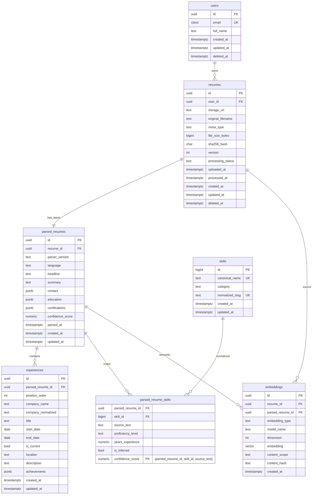

# Resume Parsing PostgreSQL Schema Design

## 1) ERD

---

## 2) SQL schema (overview)

See `sql/resume_schema.sql` for executable DDL including constraints, indexes, and pgvector setup.

---

## 3) Migration plan

1. **Enable extensions**
   - `citext` for case-insensitive email uniqueness.
   - `vector` for pgvector support.

2. **Create core identity/storage tables first**
   - `users`
   - `resumes`

3. **Create parsed semantic tables**
   - `parsed_resumes`
   - `skills`
   - `parsed_resume_skills`
   - `experiences`

4. **Create embeddings table after pgvector is available**
   - `embeddings` with `vector(1536)` (adjustable per model policy).

5. **Add indexes in same migration or follow-up online migration**
   - For large existing datasets, prefer `CREATE INDEX CONCURRENTLY` in separate migrations.

6. **Backfill/normalization workflow**
   - Load existing resume binaries/metadata into `resumes`.
   - Run parser to insert `parsed_resumes`, `experiences`, skill mappings.
   - Generate embeddings and insert into `embeddings`.

7. **Partitioning migration (future)**
   - If row volume grows (10M+ embeddings), migrate `embeddings` to hash/list partitioning by `embedding_type` or `model_name`.
   - Optionally partition `resumes` by `uploaded_at` for lifecycle management.

---

## 4) Indexing strategy

- **Primary access paths**
  - `users(email)` unique btree.
  - `resumes(user_id, created_at desc)` for user dashboard and latest resume retrieval.
  - `parsed_resumes(resume_id)` unique to enforce one current parsed snapshot per resume (or replace with `version` strategy).

- **Skill search and analytics**
  - `skills(normalized_slug)` unique btree.
  - `parsed_resume_skills(skill_id, parsed_resume_id)` for reverse lookups by skill.
  - `experiences(parsed_resume_id, position_order)` for ordered reconstruction.

- **JSONB querying**
  - GIN on `parsed_resumes(contact jsonb_path_ops)` and `education` when structured filters are needed.

- **Embedding similarity**
  - `ivfflat` (or `hnsw` when supported/version-appropriate) on `embeddings.embedding` with `vector_cosine_ops`.
  - Filtered composite index `(embedding_type, model_name, created_at)` to reduce candidate set pre-vector search.

- **Soft-delete aware indexes**
  - Partial indexes with `WHERE deleted_at IS NULL` on hot paths to keep index size small.

---

## 5) Performance & scalability considerations

1. **Normalization boundaries**
   - Keep canonical `skills` separate from extracted text via `parsed_resume_skills` bridge.
   - Store variable extractor payloads in JSONB (`contact`, `education`, `achievements`) while keeping highly queried fields relational.

2. **Write/read separation**
   - Parsing pipeline writes in async batches: first core resume row, then parsed entities, then embeddings.
   - Search APIs read from pre-indexed tables and vector indexes.

3. **Versioning strategy**
   - Add parser/model version columns (`parser_version`, `model_name`) for reproducibility and reprocessing.
   - If multiple parse attempts per resume are required, change unique constraint from `(resume_id)` to `(resume_id, parser_version)` and add `is_active`.

4. **Vector tuning**
   - Keep dimension consistent per model; enforce via `dimension` + check constraints/application guard.
   - Tune `ivfflat` list count with data scale and recall target.
   - Always pre-filter by `embedding_type` and `model_name` before ANN search.

5. **Operational scaling**
   - Use connection pooling (PgBouncer).
   - Autovacuum tuning for high-churn tables (`embeddings`, `parsed_resume_skills`).
   - Archive/delete stale resume versions with retention policy.

6. **Security and multi-tenancy**
   - Tenant isolation via `user_id` joins everywhere.
   - Optional Row Level Security for shared DB environments.

7. **Future enhancements**
   - Add `organizations`/`teams` and map users to orgs for B2B tenancy.
   - Add `job_descriptions` + `job_resume_matches` for match scoring.
